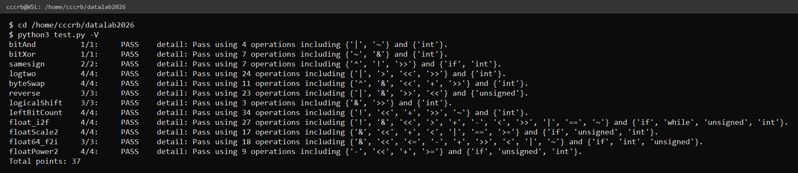

# datalab 报告

姓名：丛文博

学号：2025201897

| 题目 | 得分 |
| --------- | --------- |
| bitAnd | 1/1 |
| bitXor | 1/1 |
| samesign | 2/2 |
| logtwo | 4/4 |
| byteSwap | 4/4 |
| reverse | 3/3 |
| logicalShift | 3/3 |
| leftBitCount | 4/4 |
| float_i2f | 4/4 |
| floatScale2 | 4/4 |
| float64_f2i | 3/3 |
| floatPower2 | 4/4 |
| **总分** | **37/37** |

test 截图：



## 解题报告

### 亮点

1. `logicalShift` —— 只用 3 个运算符，用「无符号全 1 右移」直接造掩码
2. `byteSwap` —— 不挖不改，只算两个字节的差异位，一次异或同时换掉两个字节
3. `float64_f2i` —— 把大移位拆成两次小移位，绕开「移位量等于位宽」这个未定义行为

### bitAnd

德摩根律：`x & y = ~(~x | ~y)`。把「与」拆成两次取反夹一个「或」。

```c
return ~(~x|~y);
```

### bitXor

思路是「相同为 0、相异为 1」，也就是从「并集」里减掉「交集」：`x ^ y = (x | y) & ~(x & y)`。

但题目只给 `~` 和 `&`，所以再用一次德摩根律把 `x | y` 换成 `~(~x & ~y)`：

```c
return (~(x&y)&~(~x&~y));
```

### samesign

0 既不算正也不算负，所以先用 `if/else` 把「至少有一个是 0」的情况挑出来单独处理：两个都是 0 返回 1，只有一个为 0 返回 0。

剩下的情况直接比符号位。`x>>31 ^ y>>31` 在异号时为 1、同号时为 0，取反即得答案：

```c
return !(x>>31 ^ y>>31);
```

### logtwo

从高位往低位做二分。先判断 `v > 0xFFFF`：成立说明最高位在 bit16 以上，`log` 至少是 16。

把「成立与否」这个 0/1 结论左移 4 位，就得到 16 或 0。这个值一物两用 —— 既累加进 `cnt`，又当作移位量把 `v` 右移。

关键点是：**不成立时移位量是 0，移位是空操作**，所以不需要写 `if/else`：

```c
cnt=cnt|((v>0xFFFF)<<4);  v=v>>((v>0xFFFF)<<4);
```

后面依次是 8、4、2、1，五步覆盖 0~31。

### byteSwap

常见做法是「挖出来 → 清位 → 填回去」，要动两次掩码。这里换个角度：**只算两个字节的差异**。

`s ^ t` 得到两个字节的差异位。把这个差异同时左移到两个字节各自的位置再和原数异或 —— 有差异的位翻转、没差异的位不动，两个字节就同时换过来了，省掉整轮清位：

```c
int k=s^t;
x=((k<<M)+(k<<N))^x;
```

### reverse

分治法。先按 1 位一组两两对调，再 2 位一组、4 位、8 位、16 位，五轮之后位序完全倒过来。

每一轮都是同一个形状，`mask` 保证只动一半的位：

```c
v=((v>>1)&0x55555555)|((v&0x55555555)<<1);
```

最后一轮只剩左右两半，掩码都可以省掉，直接 `(v>>16)|(v<<16)`。

### logicalShift

算术右移 `x>>n` 会在高位补符号位，用掩码把高 n 位清掉即可。

掩码不用算，`0xFFFFFFFF>>n` 就能得到 —— 低 `32-n` 位全 1、高 n 位全 0。由于 `0xFFFFFFFF` 是无符号数，这里走的是**逻辑右移**，正好把 0 填进来：

```c
x=(x>>n)&(0xFFFFFFFF>>n);
```

两个右移一个与，3 个运算符。

### leftBitCount

和 `logtwo` 是同一个套路，只是方向反过来：**从高位往低位二分**。

先看高 16 位是不是全 1。`!(~(x>>16))` 就是干这个的 —— `x>>16` 等于 `-1` 时，`~` 之后是 0，`!` 之后是 1。成立就记 16 分，然后 `x<<16` 把这 16 位「移走」，继续看剩下的。

依次 16、8、4、2、1 五步。

**五步只有 2⁵=32 种结局，但答案有 0~32 共 33 种**，所以末尾还要补一次「第 32 位（符号位）是不是也是 1」：

```c
cnt=cnt+!(~(x>>31));
```

### float_i2f

按位拼装：符号位 + 阶码 + 尾数。

1. 取绝对值，同时记下符号位
2. 左移直到最高位对齐到 bit31，数出移位次数，算出阶码
3. 取高 23 位当尾数
4. 舍入用**就近取偶**：丢掉的 8 位大于 `0x80` 就进位，正好等于 `0x80`（中点）时看保留部分末位的奇偶
5. 最后用 `+` 而不是 `|` 拼尾数 —— 万一尾数从全 1 进位到 `0x800000`，这一位正好是指数域的最低位，只有 `+` 才加得上去

`INT_MIN` 单独处理：`~x+1` 对它来说会溢出（`0x7FFFFFFF + 1` 又变回它自己），所以直接返回它对应的浮点值 `0xCF000000`（即 −2³¹）。

### floatScale2

拆出符号位 `a`、阶码 `b`、尾数 `c`，分三档：

- **阶码全 0（非规格化）**：尾数直接左移一位。如果尾数最高位已经是 1，左移会把它挤出去，这时把它进位成阶码 1（`b = 1<<23`），正好过渡到规格化区
- **阶码全 1（无穷 / NaN）**：按题目要求原样返回
- **其它**：阶码 +1。加完之后如果变成全 1，自然就成了无穷，所以用 `b < 0x7f800000` 兜一下就行

### float64_f2i

双精度按 `uf2`（高 32 位）+ `uf1`（低 32 位）拼起来看：符号 1 位、阶码 11 位（偏移 1023）、尾数 52 位。

拆完阶码后分三档：

- 指数 < 0 → 绝对值小于 1 → 返回 0
- 指数 > 30 → 溢出 → 返回 `0x80000000`（`-2³¹` 也落在这里，它的位表示恰好就是 `0x80000000`，正好吻合）
- 否则把「隐含的 1 + 52 位尾数」右移 `52-指数` 位得到绝对值

移位量可能超过 32，超过时只需要用到 `uf2` 里那 20 位尾数。为了避开「移位量等于 32」这个未定义行为，把它**拆成两次**：

```c
(((uf2<<12)>>(31-mi))>>1)
```

两次的移位量都严格小于 32，`mi=0` 时结果也正确。最后按符号位取补码。

### floatPower2

三段切分：

- `x ≥ 128` → 超过最大可表示的 2 的幂（2¹²⁷）→ 返回 `+INF`
- `-126 ≤ x ≤ 127` → 正常区，阶码 = `x + 127`
- `-149 ≤ x ≤ -126` → 非规格化区，尾数 = `1 << (x+149)`
- `x < -149` → 太小 → 返回 0

## 反馈/收获/感悟/总结

位运算题的核心套路基本是两个：**构造掩码**和**复用 0/1**。像 `logicalShift` 的 `0xFFFFFFFF>>n`、`logtwo` 和 `leftBitCount` 里「同一个值既是计数又是移位量」，都省掉了大量分支。

浮点题则要先想清楚三档：正常、非规格化、特殊值。一开始总想用一个公式套到底，踩了几次坑之后才意识到阶码全 0 和全 1 必须单独想。

## 参考的重要资料

1. 《深入理解计算机系统》原书第 3 版，第 2 章「信息的表示和处理」
2. IEEE 754-2019 浮点运算标准
3. 课程 PPT
